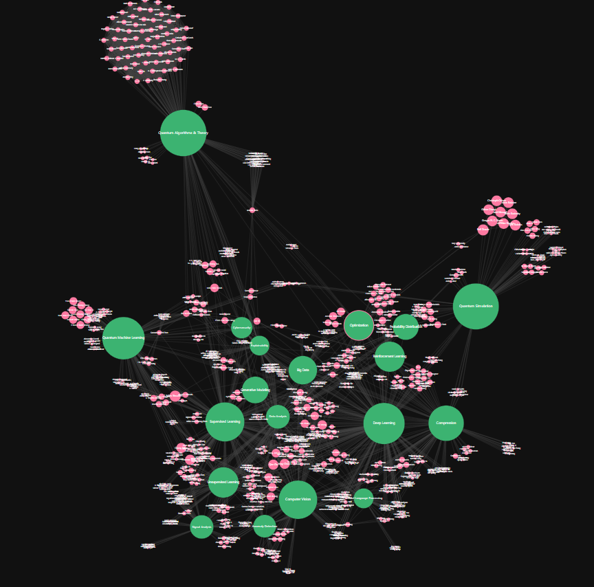

# 🧠 ML/AI Research Knowledge Graph

An interactive bibliometric network visualization of the applications of **Tensor Networks to Machine Learning and Artificial Intelligence**. Explore connections between authors, research subtopics, and papers with full APA citation data.

👉 **[View the live graph](https://gvalverde21.github.io/research-graph/graph_d3.html)**

---

## Preview

> 

---

## Features

- 🔍 **Search** nodes by name or paper title/author
- 👁 **Neighbor mode** — highlight direct connections of any node
- 🎛 **Filter by type** — toggle authors and subtopics on/off
- 📅 **Filter by publication year** — dual slider to narrow the time range
- 📄 **APA citations** — click any node to see its papers; copy citations to clipboard
- 🖱 **Draggable nodes** — rearrange the graph freely
- ⟳ **Reset view** — return to the original layout
- 📊 **Live statistics** — node and edge counts update as you filter

---

## Repository Structure

```
research-graph/
├── graph_d3.html           # Self-contained interactive visualization
├── graph_frozen.graphml    # Source graph data (nodes, edges, attributes)
├── graph_d3.py             # Python script to regenerate the HTML from the graphml
└── README.md
```

---

## How to Regenerate

Make sure you have the dependencies installed:

```bash
pip install networkx
```

Then run:

```bash
python graph_d3.py
```

This reads `graph_frozen.graphml` and outputs a new `graph_d3.html`. Open it in any browser — no server required.

---

## Data

The graph is built from a curated dataset of ML/AI research publications. Each node represents either a **research subtopic** or an **author**, and edges capture thematic or collaborative relationships. Citation metadata is stored in BibTeX format within the graph attributes.

---

## Tech Stack

- [D3.js](https://d3js.org/) v7 — graph rendering and interactivity
- [NetworkX](https://networkx.org/) — graph parsing and processing
- Python 3 — data pipeline

---

## Author

**Guillermo Valverde**  
Vicomtech  

---

## License

This project is released for academic and research purposes. If you use this dataset or visualization in your work, please cite the repository.